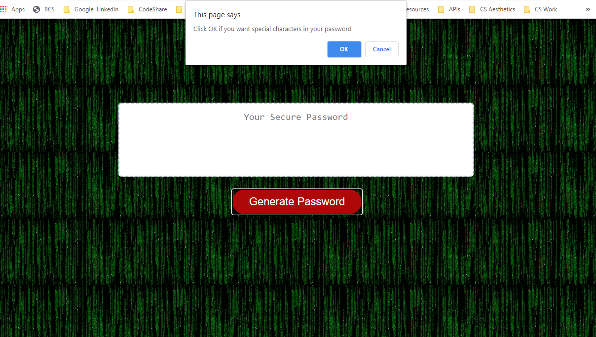
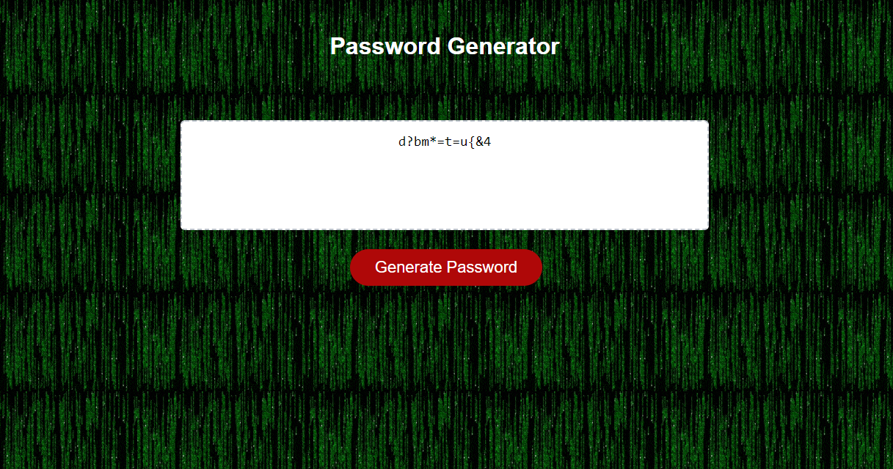

# passwordGen

## Deployed Site: https://94cooper94.github.io/passwordGen/

Your ex still have access to your Netflix password months after breaking up? Tired of re-using different iterations of the same password for every account you create? Look no further, as Cooper's passwordGen is here to spice up your life. Sneak-a-peek at the full program up above, but feel free to continue reading to learn about the logical processes involved.

Upon clicking "Generate Password", the site will prompt the user inquiring how long they would like their ideal password to be. The password must be between 8 and 128 characters.

After the user has selected an eligible password length, the password generator will prompt the user upon which the user will decide whether they want numbers, special characters, lower case and/or upper case letters in their password. 

Enjoy creating rng passwords to your heart's content!

